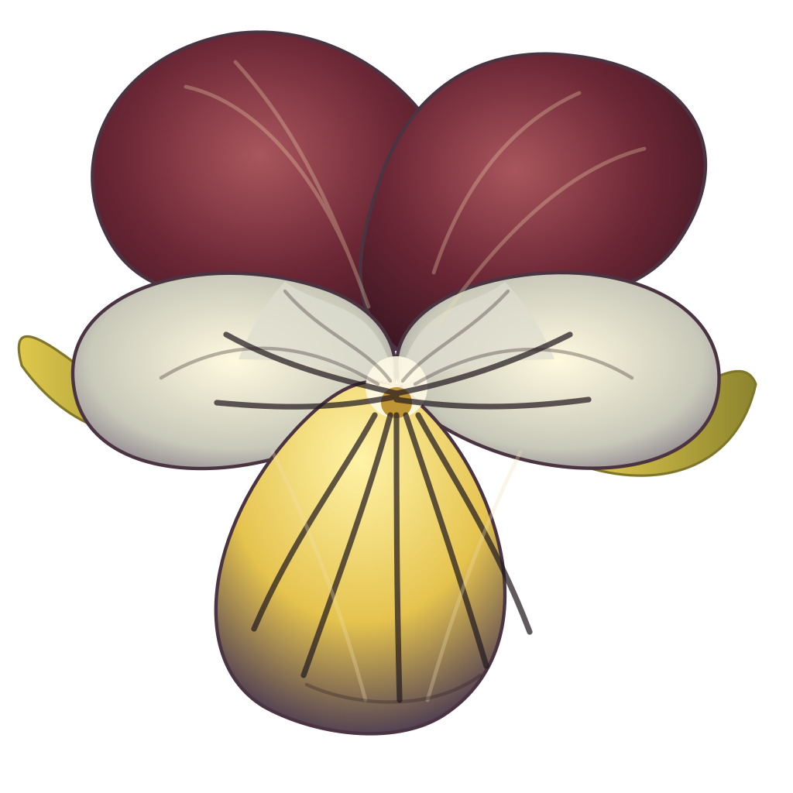

#  Puck

~~~vibecode
{"vibecode": {
	"doc": "readme",
	"role": "entry-point overview of the Puck ecoverse and its three core packages",
	"audience": ["humans_landing_on_github", "AIs_orienting_to_the_repo"],
	"key_concepts": ["Puck_ecoverse", "Puck_protocol", "Caspian", "Mikobase",
		"design_heavy_implementation_early", "canonical_specs_live_under_documentation",
		"four_guiding_principles", "lightweight_under_1mb"],
	"notes": ["umbrella_name_is_Puck",
		"directory_named_mikobase_for_historical_reasons_see_CLAUDE_md",
		"deeper_specs_organized_under_documentation_directory"]
}}
~~~

Puck is an **ecoverse** — a suite of interconnected software for querying
and executing remote objects. Active design and early implementation.

This [repository on GitHub](https://github.com/mikosullivan/puck) is the working source: design docs, the engine in progress, tests, experimental code.

You can submit issues to GitHub with these links: [GitHub issue](https://github.com/mikosullivan/puck/issues/new?title=%5Bdocs%5D%20README.md&body=Page%3A%20%60README.md%60%0A%0A%28Describe%20the%20issue%20here.%29)

## The three packages

- **[Puck (the object protocol)](https://puck.uno/documentation/requirements/puck/)** — URL-addressed remote objects; one shape for working with objects across languages, processes, and machines.
- **[Caspian](https://puck.uno/documentation/requirements/caspian/)** — a lightweight, embeddable language.
- **[Mikobase](https://puck.uno/documentation/requirements/mikobase/)** — a live, portable object store. Class-based, NoSQL; queries are JSON.

## Lightweight

Puck is kept under **1 MB** — engine, standard library, and docs all together. That
would fit on an old 3.5" floppy disk with room to spare.

The Caspian engine is written in [**Lua**](https://www.lua.org/), itself a famously
lightweight and transportable language.

## The Puck community

Puck is guided by four core principles:

- **Puck is easy.**
- **The Puck community is friendly.**
- **Software shouldn't tell you how to live your life.**
- **Everything doesn't have to be complicated.**

## Reading the docs

Start with the **[project overview](https://puck.uno/documentation/overview)** for an end-to-end tour.