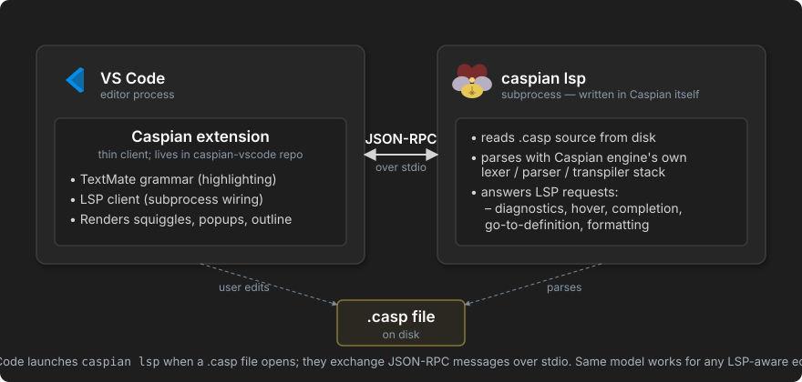

# Caspian LSP

> **Deferred to post-V1** (decided 2026-06-05). The LSP requires a local Caspian install for every editor user, which conflicts with the first-contact goal and with remote-development workflows. The VSCode extension ships syntax-highlighting only for V1; rich LSP features wait until the install story is robust enough. This spec is preserved here for when the work resumes. The build plan is at [ideas/lsp-build/](../lsp-build/).

~~~json
{"vibecode": {
	"doc": "caspian_lsp",
	"role": "spec for the Caspian Language Server — what it provides, how editors invoke it, what's in V1 vs later, written in Caspian itself and bundled with the install",
	"status": "deferred to post-V1 — see banner above",
	"protocol": "lsp_json_rpc_over_stdio",
	"implementation_language": "caspian",
	"bundled_with_install": true,
	"v1_features": ["diagnostics", "hover", "format", "go_to_definition_local",
		"completion_keywords_and_in_scope_names"],
	"deferred_to_later": ["find_all_references", "rename", "workspace_symbol_search",
		"signature_help", "code_actions_refactors"]
}}
~~~

Caspian ships a [Language Server Protocol](https://microsoft.github.io/language-server-protocol/) server — `caspian lsp` — so any LSP-compatible editor (VSCode, Vim, Emacs, Sublime, JetBrains, Helix, Zed, etc.) gets rich Caspian support without each editor needing its own implementation.

The motivation is the standard one for shipping an LSP: N editors × M languages → N + M implementations. Caspian provides one server; every editor talks to it the same way.

## What ships in V1

- **Diagnostics.** Syntax errors and basic semantic errors (unknown variable, wrong argument count) pushed to the editor as the user types. Squiggles in the gutter, errors in the problems panel.
- **Hover.** Type/role/source-location info at the cursor. For a variable, the value's source line and class. For a method, its signature.


- **Document formatting.** Editor's "Format Document" command routes to the LSP, which delegates to `caspian fmt`. Same output as the CLI formatter.
- **Go-to-definition (local).** Jump from a variable/function reference to its declaration within the same file. Cross-file definition-jumping arrives later.
- **Completion (basic).** Caspian keywords, in-scope variables, and methods on the receiver type. Not yet: imported-library symbol completion, signature-aware suggestions.

The V1 surface deliberately stays small. It's enough that adopting Caspian doesn't feel primitive compared to mainstream-language tooling, but doesn't try to match a mature LSP's full feature set.

## Low-hanging fruit

Cheap-to-ship features that meaningfully improve the experience without expanding the surface much. None are blocking V1; all are worth picking up early if there's time, because each is a small day of work and noticeably improves day-to-day editing. Not yet scoped into the [V1 build plan](https://puck.uno/documentation/ideas/lsp-build/).

- **Document symbols** (`textDocument/documentSymbol`). Powers the editor's Outline view and "Go to symbol in file" (`Ctrl+Shift+O` in VSCode). One AST walk, emit a flat list of top-level functions, classes, named expressions. Users hit it dozens of times per session.
- **Document highlight** (`textDocument/documentHighlight`). When the cursor lands on a variable, the editor highlights every other use of the same symbol in the file. Trivial from the AST plus the lexical-scope analysis already needed for go-to-definition.
- **Folding ranges** (`textDocument/foldingRange`). Emit one range per block (function body, `do...end`, `if...end`, etc.). Walk the AST, emit start/end line pairs. The editor renders collapsible regions automatically.
- **Hover for keywords and `%`-surfaces.** Static lookup table mapping `function`, `closure`, `%call`, `%role`, `%puck`, `%bucket`, etc. to a short description plus a `https://puck.uno/...` link. Zero compute — just a hash lookup. High value for new users hovering on unfamiliar syntax.
- **Selection ranges** (`textDocument/selectionRange`). Supports "expand selection" (`Ctrl+Shift+→` in VSCode and equivalents). Given the AST, it's "find the smallest enclosing node, then walk parents." Editors that use it heavily make it feel magical.
- **On-type formatting** (`textDocument/onTypeFormatting`). When the user types `end`, auto-indent to match the opening keyword's column. Reuses the formatter's indentation logic. Tiny implementation, large quality-of-life.
- **TODO/FIXME diagnostics.** Scan comments for `TODO`/`FIXME`/`XXX`, emit Info-severity diagnostics. Surfaces them in the editor's Problems panel. ~20 lines of code; almost every language plugin ships it.

If a subset of these has to be picked: `documentSymbol` + `documentHighlight` + `foldingRange` + keyword/sigil hover punch most above their weight.

## How editors invoke it



The editor launches `caspian lsp` as a subprocess and speaks JSON-RPC over stdin/stdout per the LSP specification. Standard transport — every LSP client library on every platform supports it.

```
caspian lsp
```

No arguments needed. The server reads `Content-Length`-prefixed JSON-RPC messages, processes them, writes responses to stdout. Logs go to stderr.

Editors discover the binary via `$PATH`. The Caspian installer puts the launcher on `$PATH` (see [installation stories](https://puck.uno/documentation/ideas/installation/)), so `caspian lsp` works as long as Caspian itself is installed.

## Implementation language

**Caspian.** The LSP is written in Caspian itself — same dogfooding philosophy as the installer (`install.casp`). It needs:

- Stdio JSON-RPC — handled with Caspian's standard I/O and JSON parsing.
- Caspian source parsing — the engine's lexer/parser/transpiler stack ([engine.md](https://puck.uno/documentation/requirements/caspian/engine)) is exposed to the LSP code.
- Long-running process model — the LSP stays alive for the editor session, processing requests as they arrive.

Writing the LSP in Caspian validates that Caspian is suitable for non-trivial tooling work. If the language can't comfortably implement its own LSP, that's a signal worth taking seriously.

## VSCode extension relationship

The Caspian VSCode extension is a **thin client** to the LSP:

- Syntax highlighting (TextMate grammar) — independent of LSP, ships with the extension.
- LSP client wiring — launches `caspian lsp` and routes editor events through it.

The extension lives in its own repo ([caspian-vscode](https://github.com/mikosullivan/caspian-vscode)) — separate from the main Caspian repo because VSCode extensions have their own marketplace publishing process.

Other editors get LSP support by configuring their LSP client to launch `caspian lsp` when editing `.casp` files. Standard LSP setup — same as configuring `pyright` for Python or `rust-analyzer` for Rust.

## Bundle footprint

`caspian lsp` source is part of the bundled Caspian install — roughly **~80 KB of Caspian source** (see [installation/index.md § What the installer downloads](https://puck.uno/documentation/ideas/installation/#what-the-installer-downloads)). No additional C extensions; the LSP uses only what Caspian itself uses (Lua, LPeg, libsodium).

## Future options

Everything in this section is **post-V1** — not blocking the V1 ship, but worth keeping in view as the surface matures. No architectural blocker for any of these; the constraint is scope.

### Features for later slices

- **Find all references.** Requires cross-file indexing.
- **Rename symbol.** Requires cross-file indexing + write-back.
- **Workspace symbol search.** Index all symbols in a project for quick navigation.
- **Signature help.** Showing parameter info as the user types arguments.
- **Code actions** — quick fixes, extract-variable, organize-imports, etc.
- **Inlay hints.** Showing inferred types inline.
- **Semantic tokens.** Richer syntax highlighting via LSP rather than per-editor TextMate grammars.

### Open questions to resolve before those land

- **Cross-file analysis for V1?** Even basic go-to-definition across files would require building a workspace index. Likely defer to a follow-up slice; flag as a stretch goal for V1.
- **Workspace configuration discovery.** How does the LSP know about a project's library layout, `%puck` resolutions, etc.? Probably a `.caspian/` config dir at the project root, but not yet specified.
- **Restart and crash recovery.** If the LSP crashes mid-session, how does the editor recover? Standard LSP clients handle restart; the question is what state the LSP needs to rebuild on restart.
