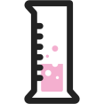

# Xeme tests

~~~vibecode
{"vibecode": {
	"doc": "requirements_bryton_xeme_tests",
	"role": "spec for the test form of a Xeme — a xeme without a `nested` field. Sibling of groups.md. Covers the single test class (`test`) currently spec'd.",
	"status": "spec in progress — base test class settled; more classes may join as they emerge",
	"audience": "anyone producing or consuming Xeme tests"
}}
~~~

A xeme is a **test** if it does NOT have a `nested` field. It reports the result of a single verifiable operation.

## Classes

For now there is only one test class.

### Base class

The base test class is **`test`**.

~~~json
{
	"success": true,
	"class": "test"
}
~~~
