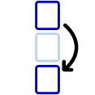

# Xeme result classes

~~~vibecode
{"vibecode": {
	"doc": "requirements_caspian_bryton_xeme_results",
	"role": "spec for the result classes a Xeme can carry — the classification of what happened (success, failure, null variants). Sibling of groups.md and tests.md. Covers the three base classes (success/failure/null) and success/null subclasses; the failure hierarchy lives at failure.md.",
	"status": "spec in progress — three base classes settled; success/skipped and null/promise subclasses spec'd here; failure subclasses live on the failure page",
	"audience": "anyone producing or consuming Xeme results"
}}
~~~

Result classes classify what happened when a xeme was produced — a success, a failure of some specific kind, or an undecided outcome.

## The `result` field

A result lives in the xeme's **`result`** field. Its own `class` field names which result class applies, and any additional fields on the result carry the details of that class:

~~~json
{
	"success": false,
	"class": "test/eq",

	"result": {
		"class": "failure",
		"expected": "foo",
		"actual": "bar"
	}
}
~~~

The xeme's `class` names what kind of xeme it is (a test, a group, etc.); the `result.class` names what happened.

## Base classes

There are three base classes for results, one for each value of the required `success` field: **`success`**, **`failure`**, and **`null`**.

### Success

The base success class is **`success`**.

**Most successes need no explicit result.** If a xeme is marked `"success": true` and the result would just be plain `success`, it's usually not necessary to state this class explicitly — or to include a `result` field at all.

#### Skipped

**`success/skipped`** indicates that the test (or tests) were not run because they were intentionally skipped.

### Failure

See [failure](failure) — the failure hierarchy lives on its own page because it has enough branches to warrant one.

### Null

**`null`** means a determination of success or failure has not been reached.

#### Promise

**`null/promise`** indicates that a final result is expected eventually.

