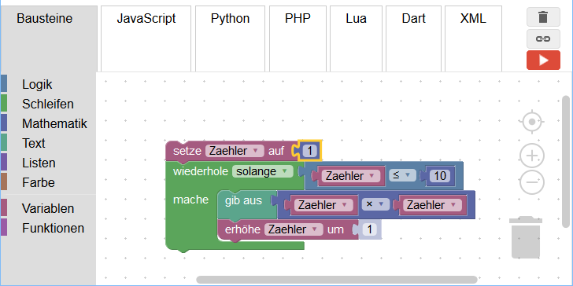

# Blockly

~~~vibecode
{"vibecode": {
	"doc": "ideas_caspian_gui_prior_art_blockly",
	"role": "prior-art notes on Blockly — Google's JavaScript library for building block-based editors; the engine under App Inventor, code.org, and dozens of other visual-programming products.",
	"status": "brainstorm reference"
}}
~~~

Blockly is a JavaScript library, not a product. Google released it in 2012 as the block-editor engine extracted from MIT's App Inventor (which Google had been hosting), and the library has since become the shared foundation under a large slice of the block-based programming world — App Inventor, Code.org's Hour of Code activities, Microsoft MakeCode, Ozobot, mBlock, and many others all render their blocks with Blockly under the hood. Scratch 3.0, released in 2019, is built on a fork of Blockly maintained by the Scratch team.

The visual grammar is the same puzzle-piece scheme Scratch popularized: rounded / notched shapes for value expressions (a rounded pill plugs into a rounded socket), C-shaped brackets that wrap statement stacks, hat-shaped event blocks that start a script. A toolbox palette lives on one side of the workspace; the developer configures which categories and which blocks appear. As the user drags blocks together, Blockly emits source code in one of several target languages — JavaScript, Python, PHP, Lua, and Dart come with the library, and third-party generators cover others. The generated code is intended to be run, not just displayed; the library treats "your blocks compile to real code in a real language" as core functionality rather than a demo feature.

Extension is a first-class concern. A host application defines custom blocks by describing their shape (inputs, connection types, colour, tooltip) and providing a code-generator function that turns each block into text in the target language. That's the pattern App Inventor uses to expose Android APIs as blocks, MakeCode uses to expose micro:bit hardware, and every domain-specific block editor uses to make its own vocabulary. There is no separate authoring tool; the definitions are plain JavaScript objects the host application ships.

For Caspian-GUI, three things about Blockly stand out: (1) the library-not-product model — Google ships an editor engine that other people package into products, which is a different distribution shape from Scratch's single hosted destination; (2) the multi-backend code-generator architecture, where the same block layout can emit different target languages depending on which generator is loaded; and (3) the custom-block extension model, which is how every derivative has grown its own domain vocabulary without forking the core. The generated-code angle is especially relevant — Blockly treats the visual editor as a *front-end for a text language*, not as a self-contained execution environment, which is closer to what a Caspian-GUI would need than Scratch's baked-in runtime.

## License

Free and open-source under [Apache License 2.0](https://github.com/google/blockly/blob/master/LICENSE). Source: [github.com/google/blockly](https://github.com/google/blockly). Google maintains the library; embedders (Scratch, App Inventor, code.org, and dozens of others) ship their own products on top of it.

## Source

- Project home: <https://developers.google.com/blockly>
- Source repository: <https://github.com/google/blockly> — Apache License 2.0
- Screenshot: [File:Blockly-Demo.png](https://commons.wikimedia.org/wiki/File:Blockly-Demo.png) by Knospe on Wikimedia Commons, licensed CC BY-SA 4.0.
