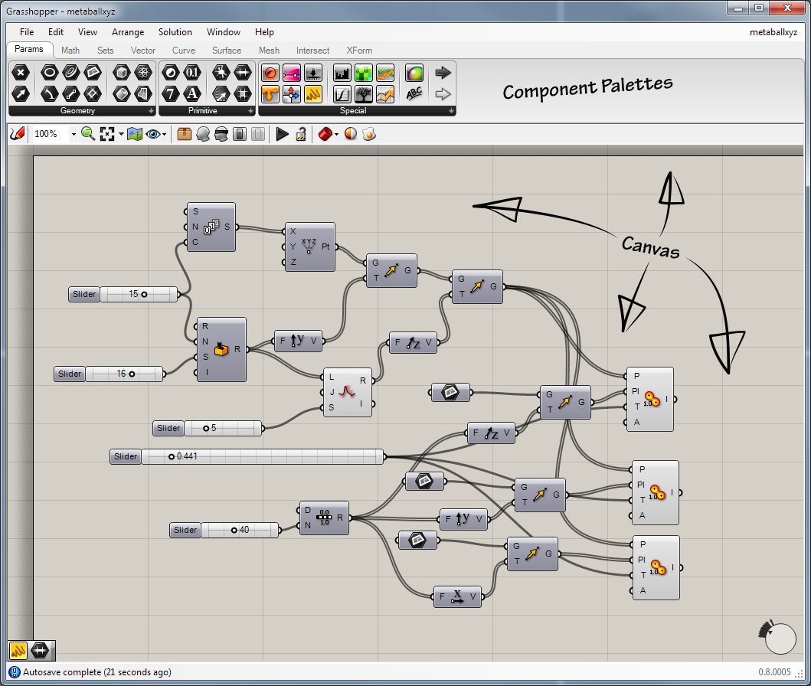

# Grasshopper

~~~vibecode
{"vibecode": {
	"doc": "ideas_caspian_gui_prior_art_grasshopper",
	"role": "prior-art notes on Grasshopper — a visual programming environment for parametric design inside Rhino 3D; widely used in architecture and computational design for generating geometry from procedural definitions.",
	"status": "brainstorm reference"
}}
~~~

Grasshopper is a node-graph visual programming environment for generating parametric geometry inside Rhino 3D. Users compose a definition by dragging components onto a canvas and wiring their output ports to the input ports of downstream components. Each component is a small operation — construct a point, loft a surface, divide a curve, evaluate a mesh — and the resulting geometry renders live in the Rhino viewport next to the canvas.

David Rutten built it at Robert McNeel & Associates and shipped the first release in September 2007. It rode along as a free plug-in for years and was folded into the standard Rhino toolset starting with Rhino 6 in 2018, which is roughly when it went from "power-user extra" to "assumed part of the workflow" in architecture schools and computational-design practices.

The visual programming works with two panes side by side: a canvas of wired components, and Rhino's regular 3D viewport showing what those components produce. Values enter the graph through UI primitives — number sliders, panels, colour pickers, boolean toggles, curve pickers that reach into the Rhino scene — and any change re-runs the affected downstream components immediately. The port-and-wire metaphor carries typed data: numbers, points, vectors, curves, surfaces, meshes, and Grasshopper's own tree-of-lists data structure. A large standard library ships with the tool; escape hatches for custom logic exist as C#, VB, and Python scripting components that drop into the graph like any other node.

What is interesting for [Caspian-GUI](https://www.puck.uno/ideas/caspian-gui/):

- **Live-preview loop.** Move a slider, the graph re-evaluates, the viewport updates. Reasoning happens in the feedback loop, not in a build/run cycle. This is the strongest argument that a visual environment can be more productive than a text editor for certain domains, not just more approachable.
- **Domain saturation.** Grasshopper ships with hundreds of geometry-manipulation components out of the box. The lesson is that a node-graph tool becomes useful in a domain roughly when the domain's primitives are all one drag away — not before.
- **Custom components via script.** Rather than trying to express every possible operation as a wired sub-graph, Grasshopper lets a user drop in a scripting component and write C# or Python inline. The visual language handles the wiring; the textual language handles the arithmetic. Both live in the same file.
- **Non-programmer adoption.** Grasshopper's user base is dominated by architects, industrial designers, and jewellery designers — professions that are not natively programmer-heavy but produce non-trivial parametric definitions with it. Evidence that the node-graph interface lowers the entry cost enough to matter for people who would not otherwise write code.
- **The data-tree gotcha.** Grasshopper's tree-of-lists structure is famously the thing that trips up new users — the visual metaphor holds up beautifully until you need to reason about list matching between ports, at which point users fall off a cliff. A cautionary example about hiding structural complexity behind wires.

## License

Bundled with Rhinoceros 3D, which is proprietary commercial software from [Robert McNeel & Associates](https://www.rhino3d.com/). A paid Rhino license is required. Grasshopper was a free plugin through Rhino 5; starting with Rhino 6 (2018) it ships as an integrated component of Rhino at no separate cost. Third-party Grasshopper plugins (there are hundreds) each carry their own license — many are free, some are commercial.

## Source

- Wikipedia article: [https://en.wikipedia.org/wiki/Grasshopper_3D](https://en.wikipedia.org/wiki/Grasshopper_3D)
- Product page: [https://www.rhino3d.com/features/#grasshopper](https://www.rhino3d.com/features/#grasshopper)
- Community hub: [https://www.grasshopper3d.com/](https://www.grasshopper3d.com/)
- Screenshot: [File:Grasshopper MainWindow.png](https://commons.wikimedia.org/wiki/File:Grasshopper_MainWindow.png) on Wikimedia Commons, by David Rutten (2011), dual-licensed CC BY-SA 3.0 / GFDL 1.2+. Used here under CC BY-SA 3.0; attribution to David Rutten.
