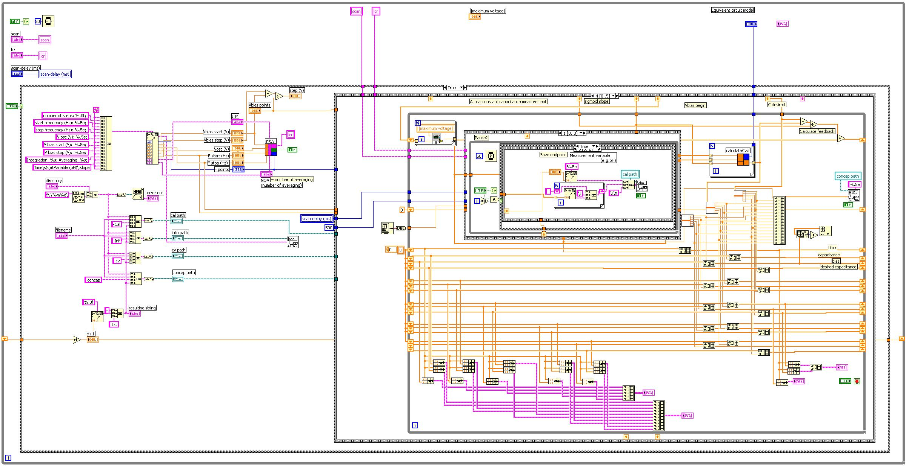

# LabVIEW

~~~vibecode
{"vibecode": {
	"doc": "ideas_caspian_gui_prior_art_labview",
	"role": "prior-art notes on LabVIEW — National Instruments' graphical dataflow language (first released 1986); the archetype for professional visual programming, aimed at test/measurement and instrument control.",
	"status": "brainstorm reference"
}}
~~~

LabVIEW (Laboratory Virtual Instrument Engineering Workbench) is a graphical dataflow programming language and IDE built by National Instruments. The first release shipped for the Macintosh in 1986, making it the granddaddy of professional visual programming — 40 years of continuous production use in test-and-measurement labs, industrial automation, and instrument control long before "low-code" was a marketing category. It runs on Windows, macOS, and Linux, and targets everything from desktop data-acquisition benches down to real-time embedded controllers and FPGAs via the same source form.

A LabVIEW program is a Virtual Instrument, or VI. Every VI has two windows that live side by side: a **Front Panel**, which is a real interactive UI — knobs, meters, graphs, numeric indicators, buttons — that becomes the actual runtime interface of the program; and a **Block Diagram**, which is where the code lives as a graph of wired function nodes. Wires carry typed values from output terminals to input terminals; wire color and thickness encode the datatype (orange for floats, blue for integers, green for booleans, pink for strings, thicker wires for arrays and clusters). Execution order is not top-to-bottom, it is data dependency — a node fires as soon as all its input wires have values, so independent subgraphs run in parallel automatically. Control structures like For Loop, While Loop, Case, and Sequence are drawn as **frames** on the diagram, and everything inside the frame runs under that structure's control. Sub-VIs are just VIs used as nodes in a larger diagram; the Front Panel becomes the sub-VI's parameter/return interface.

What is worth stealing for Caspian-GUI is the **Front Panel / Block Diagram split** — one surface is the UI the end user sees, the other is the code that drives it, and they are the same artifact viewed two ways. That means UI is not something you bolt on after the logic works; it is co-authored with the logic, and every value on the diagram has an obvious place to surface (or not) on the panel. **Dataflow-first semantics** — instead of a control-flow-first model where you explicitly sequence statements and add parallelism as an escape hatch — is the other big idea: parallelism is the default, sequencing is opt-in via frames. Also worth studying is how LabVIEW encodes **type into the visual channel itself**: wire color and thickness carry the type signature, so a diagram tells you at a glance what is flowing where without needing to hover or read declarations.

The trade-offs LabVIEW has paid over 40 years are also part of the prior art. Diagrams get hard to read at scale (the "spaghetti wire" problem) and the file format is binary, which makes source control and diffing painful; the modern LabVIEW NXG attempt to rewrite the IDE was cancelled in 2020. Both failure modes matter to a fresh design: a visual language needs a text-friendly source form for diffs, and it needs first-class abstraction (sub-VIs are the LabVIEW answer, but naming and finding them across a project is its own UX problem).

## License

Proprietary commercial software from [NI](https://www.ni.com/) (formerly National Instruments). Paid license required for commercial use; pricing tiers include LabVIEW Base, Full, and Professional. Free [LabVIEW Community Edition](https://www.ni.com/en/support/downloads/software-products/download.labview-community.html) is available for non-commercial personal, academic, and educational use (introduced in 2020). No source access under any tier.

## Source

- Image: [LabVIEW_Block_diagram.JPG](https://upload.wikimedia.org/wikipedia/commons/f/ff/LabVIEW_Block_diagram.JPG)
- Description page: [File:LabVIEW Block diagram.JPG on Wikimedia Commons](https://commons.wikimedia.org/wiki/File:LabVIEW_Block_diagram.JPG)
- License: Public domain (released worldwide by the copyright holder).
- Attribution: Wikimedia Commons user "Labvi." Depicts an example LabVIEW 7.1 Block Diagram; used across multiple Wikipedia language editions.
