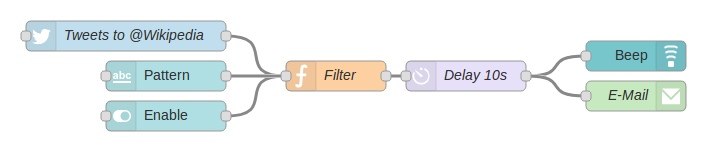

# Node-RED

~~~vibecode
{"vibecode": {
	"doc": "ideas_caspian_gui_prior_art_node_red",
	"role": "prior-art notes on Node-RED — IBM's browser-based visual flow editor; nodes are functions, wires are messages, aimed at IoT and integration workflows.",
	"status": "brainstorm reference"
}}
~~~

Node-RED is a browser-based flow editor whose runtime is Node.js. You open the editor in a browser, drag rounded-rectangle nodes out of a palette on the left, wire their output ports to other nodes' input ports on a central canvas, and hit a **Deploy** button to push the flow to the running Node.js process. Each node is a small piece of JavaScript that receives a `msg` object, does something with it (transform, filter, call an HTTP endpoint, toggle a GPIO pin), and emits it on one or more output ports. A flow is a directed graph of these nodes; the runtime carries `msg` objects along wires from one node to the next. Flows are persisted as JSON.

The project came out of IBM's Emerging Technology Services group in 2013 — Nick O'Leary and Dave Conway-Jones are the original authors. IBM contributed it to the JS Foundation as open source in 2016, and it now lives under the OpenJS Foundation with an Apache-2.0 license. The original target audience was Internet-of-Things prototyping, and that's still the strongest use case (Raspberry Pi, MQTT, industrial protocols, home automation), but a large part of what people use it for now is API glue and workflow integration — the same slot Zapier and n8n occupy, with a richer editor and a self-hostable runtime.

Visually, nodes are colored rounded rectangles about 120 pixels wide with a small icon on the left and a label in the middle; connection ports are small square nubs on the left (input) and right (output). A wire is a bezier curve between two ports. Colors are per-node-type rather than per-category — an `http request` node is teal, a `function` node is orange, a `debug` node is green — so scanning a large flow you learn to spot the debug and function nodes by color before reading the labels. Double-clicking a node opens a right-hand **sidebar** with that node's configuration form; a separate tab in the same sidebar shows debug messages that `debug` nodes have emitted. The Deploy button in the top right is the only way changes take effect — until you deploy, the running flow is whatever was last deployed and the canvas is scratch. Custom node types are shipped as npm packages (`node-red-contrib-*` by convention); installing one adds new palette entries. A flow is one page/tab in the editor; a project can have many.

For Caspian-GUI the interesting bits are the ones that come from Node-RED taking its metaphor literally. **Wires carry values, not control** — the `msg` object is a JSON dictionary that each node mutates or replaces, and the runtime doesn't distinguish "data flow" from "control flow" the way a lot of visual languages do. That's a small, honest primitive that composes surprisingly well. The **deploy step** matters: separating "the flow I'm editing" from "the flow that is running" gives you an atomic write-and-swap and a natural place to hang static validation, and it means the editor doesn't have to be crash-safe against half-typed programs. **Configuration-by-sidebar** rather than inline text keeps the canvas from turning into a wall of parameter noise — the graph shows shape, the sidebar shows detail — but it also means the canvas alone doesn't tell you what a node will do, which is a real cost worth being aware of. The **`function` node** as an escape hatch — a node whose entire configuration is a JavaScript textarea — is worth pondering: rather than growing infinitely many custom node types, Node-RED accepts that some steps are easier to type than to wire, and provides a first-class hole to type them into. And the **npm-package delivery** of custom nodes is a real-world example of a visual editor pulling extensions from the same package ecosystem as its host language, with all the good and bad that implies (huge catalog, no curation, versioning is on you).

## License

Free and open-source under [Apache License 2.0](https://github.com/node-red/node-red/blob/master/LICENSE). Source: [github.com/node-red/node-red](https://github.com/node-red/node-red). Now a project under the [OpenJS Foundation](https://openjsf.org/), having originated at IBM Emerging Technology. Custom nodes are npm packages, each under its own license.

## Source

- Image: [Node-RED_Example.png](https://upload.wikimedia.org/wikipedia/commons/2/23/Node-RED_Example.png)
- Description page: [File:Node-RED Example.png on Wikimedia Commons](https://commons.wikimedia.org/wiki/File:Node-RED_Example.png)
- License: Creative Commons Attribution-ShareAlike 4.0 International (CC BY-SA 4.0). Node-RED itself is separately licensed Apache-2.0.
- Attribution: Uploaded by Wikimedia Commons user "1-Byte" on 2018-07-20; described as "A flow for Node-RED consisting of some nodes." Node-RED is a project of the OpenJS Foundation, originally authored by Nick O'Leary and Dave Conway-Jones at IBM Emerging Technology.
- Project home: [nodered.org](https://nodered.org/)
- Source repository: [github.com/node-red/node-red](https://github.com/node-red/node-red)
