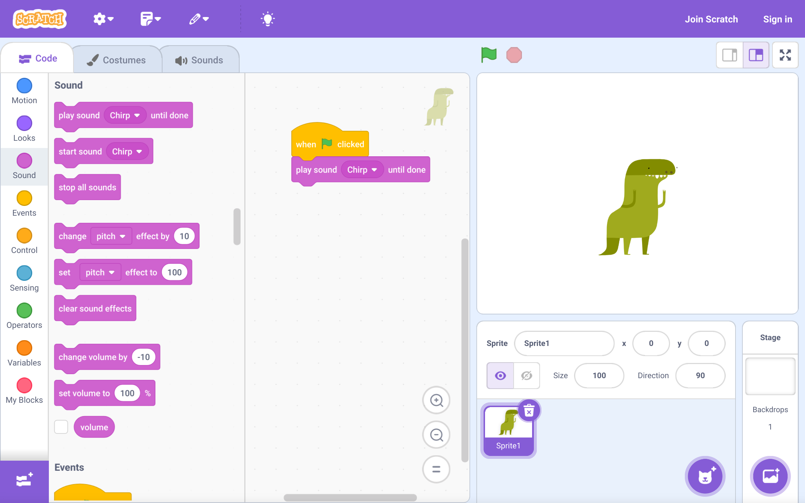

# Scratch

~~~vibecode
{"vibecode": {
	"doc": "ideas_caspian_gui_prior_art_scratch",
	"role": "prior-art notes on Scratch — MIT's drag-and-snap block-based language for kids; the paradigm that popularized block-based visual programming.",
	"status": "brainstorm reference"
}}
~~~

Scratch is a block-based visual programming language and online community built by the Lifelong Kindergarten Group at the MIT Media Lab, led by Mitchel Resnick. Scratch 1.0 launched in 2007 as a desktop Squeak/Smalltalk application; Scratch 2.0 (2013) moved into the browser on Flash; Scratch 3.0 (2019) rewrote the editor in HTML5/JavaScript on top of Scratch Blocks (an MIT fork of Google's Blockly). It is free, open-source, and aimed primarily at ages 8-16, though it also anchors introductory CS curricula at every level. The web editor at scratch.mit.edu is the reference host; Scratch programs are called "projects" and are typically shared publicly.

Programs are assembled by dragging colored blocks from a category palette on the left and snapping them together in a script area to the right. The stage in the upper-right runs the program live: sprites move, talk, and react in response to whichever hat block fires. Blocks are color-coded by category — Motion (blue), Looks (purple), Sound (pink), Events (yellow), Control (gold), Sensing (cyan), Operators (green), Variables (orange), and user-defined My Blocks (magenta) — so a glance at the script tells you roughly what kind of work is happening where. Each sprite carries its own scripts, costumes, and sounds; the stage carries backdrops and its own scripts. Every project's source is one screen: no files, no imports, no build step.

The trick worth studying is that Scratch encodes type into block **shape**, not into text a user has to read. Hat blocks (rounded top, notched bottom) start scripts and only fit at the top. Stack blocks (notched top and bottom) are statements and chain vertically like LEGO. Reporter blocks are rounded ovals that return a value and only drop into rounded slots. Boolean blocks are hexagons that only fit hexagonal slots. C-blocks (loops, `if`) wrap other stack blocks inside their mouths. Cap blocks (notched top, flat bottom) end a script. Because the shapes only mate one way, the editor makes it structurally hard to write a syntactically invalid program — the type system is enforced by the puzzle-piece geometry rather than by a red squiggle after the fact.

For the Caspian-GUI direction, several things are worth stealing. **Shape-based type inference** — round=value, hexagon=boolean, notched=statement — is a way to surface types without a hover or a compiler diagnostic; the shape *is* the type signature. **Explicit categorized palettes** solve the blank-page-and-a-blinking-cursor problem: every operation the language offers is right there to be browsed, and category color reinforces where things live. **Live, click-to-run execution** — you can click any block, or any sub-expression, to see what it does right now against the current state — collapses the edit-run-observe loop into a single gesture. And **one-screen projects** (no filesystem, no imports at the surface) matches the "first-contact" instinct of getting a beginner to a running program before making them buy into a project model. The trade-off Scratch accepts to get there is limited scale: real Scratch projects hit walls around a few thousand blocks, and there is no meaningful module system. That's a deliberate ceiling for the audience, but the shape-typed palette idea generalizes past it.

## License

Free and open-source. Scratch 3.0's GUI is [BSD 3-Clause](https://github.com/scratchfoundation/scratch-gui/blob/develop/LICENSE); Scratch Blocks (the block-editor library, forked from Google's Blockly) is Apache 2.0. Runs as a free hosted service at scratch.mit.edu. User-created projects on that site are automatically licensed CC BY-SA. Source: [github.com/scratchfoundation](https://github.com/scratchfoundation).

## Source

- Image: [Scratch_3.0_editor.png](https://upload.wikimedia.org/wikipedia/commons/0/0d/Scratch_3.0_editor.png)
- Description page: [File:Scratch 3.0 editor.png on Wikimedia Commons](https://commons.wikimedia.org/wiki/File:Scratch_3.0_editor.png)
- License: Creative Commons Attribution-ShareAlike 2.0 Generic (CC BY-SA 2.0). The Scratch editor software is separately licensed BSD 3-Clause; the Scratch logo and character trademarks are excluded from CC-BY-SA and used per Scratch's terms of use.
- Attribution: "Screenshot is own work, Scratch is by MIT and other contributors." Captured 2023-08-24 from https://scratch.mit.edu/projects/editor.
