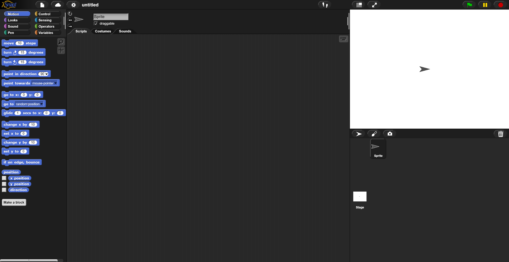

# Snap!

~~~vibecode
{"vibecode": {
	"doc": "ideas_caspian_gui_prior_art_snap",
	"role": "prior-art notes on Snap! — UC Berkeley's Scratch-like block language with first-class procedures, lists, and continuations; used in Berkeley's Beauty and Joy of Computing course.",
	"status": "brainstorm reference"
}}
~~~

Snap! is a browser-based visual programming environment built as an extended reimplementation of Scratch. From a distance it looks like Scratch — the same colored, snap-together blocks, the same sprite-and-stage runtime — but under the hood it's a serious language. Procedures are first-class values that can be passed around, stored in variables, and returned from other procedures; lists are first-class and nestable; and it exposes call-with-current-continuation to the block layer. The "Build Your Own Blocks" name (Snap! is the successor to a project called BYOB) is the pitch: the extensibility story is that users define new blocks, then hand those blocks around like any other value.

Snap! is developed by Jens Mönig (of SAP) with design input and documentation by Brian Harvey at UC Berkeley. It's the language behind Berkeley's *Beauty and Joy of Computing* course (CS10 and the corresponding AP CS Principles curriculum). The whole thing runs in the browser as pure JavaScript — no plugin, no install, view-source works — which was a deliberate move away from the Flash-era Scratch 1.x.

The visual grammar keeps Scratch's category coloring (Motion blue, Looks purple, Control gold, Operators green, etc.) and its jigsaw-puzzle fit rules: hat blocks start scripts, stack blocks connect vertically, reporter blocks are rounded and fit into oval sockets, predicate blocks are hexagonal and fit into hexagonal sockets, C-shaped blocks wrap other stacks. Snap! adds a "ring" wrapper — the grey rounded border you draw around a block or script to turn it into a first-class procedure value — and "hyperblocks" that map operations over nested lists in the APL tradition. The Build-Your-Own-Blocks dialog lets a user compose a new block from existing ones and pick which category (and therefore color and shape) it should join.

What's interesting for Caspian-GUI: Snap! is the existence proof that Scratch's UX and a real programming language aren't mutually exclusive. The block palette, the drag-to-connect grammar, and the beginner-friendly stage-and-sprite runtime all survive when you add closures, continuations, and user-defined blocks. Two ideas worth stealing: (1) the "ring" gesture — a small, learnable UI affordance that promotes a block or script into a first-class value, which is the kind of syntactic move Caspian would need for its own closure story if it went visual; and (2) the extensibility path — users defining new blocks that look and feel exactly like built-in blocks, with no meta-layer distinction. Both are done without abandoning the visual grammar most people will already recognize from Scratch.

## License

Free and open-source under the [GNU Affero General Public License v3 (AGPL-3.0)](https://github.com/jmoenig/Snap/blob/master/LICENSE). Source: [github.com/jmoenig/Snap](https://github.com/jmoenig/Snap). Runs entirely in the browser at snap.berkeley.edu — no server-side execution. AGPL means any network-facing derivative must also be open-source.

## Source

- Homepage: <https://snap.berkeley.edu/>
- About page: <https://snap.berkeley.edu/about>
- Source (GitHub): <https://github.com/jmoenig/Snap>
- Wikipedia: <https://en.wikipedia.org/wiki/Snap!_(programming_language)>
- Screenshot: [File:Snap_4.0_Default_screen.png](https://commons.wikimedia.org/wiki/File:Snap_4.0_Default_screen.png) by DancingPhilosopher on Wikimedia Commons, licensed [CC BY-SA 4.0](https://creativecommons.org/licenses/by-sa/4.0/).
- Snap! itself is released under the [GNU Affero General Public License v3](https://github.com/jmoenig/Snap/blob/master/LICENSE) with an additional grant permitting proprietary user projects.
