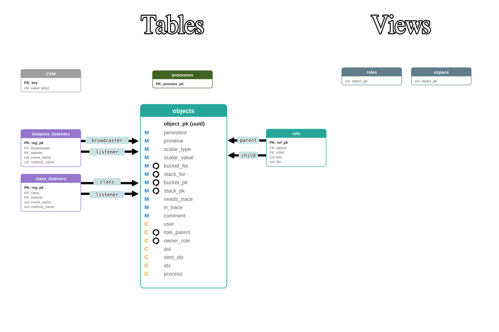

# Frames as objects

~~~vibecode
{"vibecode": {
	"doc": "ideas_frames_as_objects",
	"role": "brainstorm exploring folding the four frame-attached tables (frames, frame_locals, frame_delegations, frame_ambers) into the objects table. A frame becomes just another objects row so the object-graph GC keeps captured scope alive for closures that outlive their defining frame. Working sketch of the resulting schema lives at src/cvm.sql, ER diagram at documentation/frames-as-objects.svg, and worked-through walkthroughs (closure, end-of-bootstrap, …) at examples/. Not spec — exploration.",
	"status": "brainstorm"
}}
~~~

Exploring folding frames into the object table.

## Overview

The primary reason to do this is **closure lifetime**: a closure that outlives its defining frame must keep the captured scope alive, and the current schema has no mechanism to do that. Under the frames-as-objects model, a closure holds an ordinary object-graph reference to its enclosing frame; that reference makes the frame uspace-anchored; the frame lives as long as any closure (or anything else) points at it. GC collects it only when the last reference goes, and its captured locals — living in its bucket — go with it. That's exactly what real closure semantics require.

**What breaks in the current MVM.** Frames are a dedicated table. `frame_locals` cascades on frame delete. `lexical_parent` is `ON DELETE SET NULL` — a spec-level admission the link can go stale (the schema comment: "engine-side concern, not a corruption"). Fine for a walking skeleton with no escaping closures. The moment a closure returns from its defining function and gets called later, its captured `$x` is gone.

**What folding into `objects` fixes.** Frames become ordinary objects. Locals become bucket entries. `lexical_parent` becomes a plain object reference. The whole thing participates in the standard object-graph mark-sweep — no special-case cascade rule, no "SET NULL" resignation. Reference → alive. No reference → collected.

## What changes

- `frames` — gone as a table. Each frame becomes an `objects` row (ast in `objects.ast`, other frame fields — process, idx, lexical_parent, next_stmt_idx — either become columns on `objects` or entries in the frame-object's bucket).
- `frame_locals` — gone. Locals become bucket entries on the frame-object.
- `frame_delegations`, `frame_ambers` — gone. Same treatment.
- **`processes` stays** as call-stack roots (one row per stack).
- `objects`, `relationships`, `instance_listeners`, `class_listeners` unchanged in role.

Ten tables → six. See the diagram at the top of this page for the target layout and [cvm.sql](./src/cvm.sql) for the working schema sketch.

## Consequences (nice, but not the point)

Once frames-as-objects is on the table for the closure reason, some downstream wins fall out:

- **Reflection is free.** `%process.frames` is an ordinary array of ordinary objects. Walking the call stack, filtering it, mapping over it — all use the language's existing hash and array primitives.
- **Uniform GC.** No special uspace anchors for frames; frames participate in mark-sweep like anything else.
- **"Caspian all the way down."** The runtime call stack is objects, not a parallel structure hiding in special tables.
- **Simpler schema surface.** Fewer specialized triggers, fewer cross-table cascade paths.

## Trade-offs the exploration will need to work out

- **Constraints frames currently enforce at the schema level** — `unique (process_pk, idx)` on the stack, `check type in ('function_call')` on frame kind, immutability triggers — become harder to express when frames are just object rows. Either CHECK conditions gated on "is this row a frame?" or move to engine-side enforcement.
- **`objects.ast` does double duty.** Definitional CaspM for a callable vs. currently-executing snapshot for a frame-object. Same column, two lifetime stories.
- **Perf question.** `objects` is already the busiest table; every stack push/pop now touches it too.
- **Frame identification.** How does the schema (or engine) recognize an object row as a frame vs. a regular object? Distinguishing column, structural inference from FKs, or something else — not yet decided.
