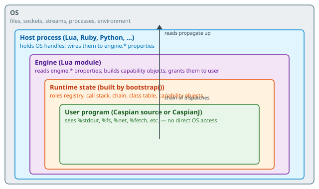
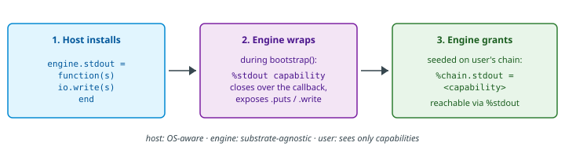

# How the engine wires up external resources at startup

~~~vibecode
{"vibecode": {
	"doc": "ideas_io_wiring",
	"role": "design report tracing how external resources (stdout, filesystem, network, fetch, subprocesses) get from OS-level primitives up to user Caspian code at engine startup. Complements requirements/bootstrap/ (the settled 'load module, set properties, call run' mechanics) and requirements/initial-state/ (what's guaranteed to exist when the first statement runs). This doc walks the actual data flow end-to-end and flags where the model is still hazy — intended as a runway before Miko implements the wiring.",
	"status": "design report — synthesizes the current spec, flags gaps, does not itself claim to be spec"
}}
~~~

Bootstrap-level docs already spell out the mechanics of how a host loads the engine, sets properties on it, and calls `run()`. What's still hazy is the actual **data flow** — when a user program does `puts 'hi'`, what chain of things has to have been wired to make that call reach an OS write? Same question for `%fs['/tmp/foo'].read`, `%net.tcp_connect(...)`, `%fetch('...')`. This doc walks the chain end-to-end.

## The layers

Each inner layer can see the layer immediately outside it, but not the layer beyond. The user program calls `%stdout.puts 'hi'` — that resolves through the runtime state to a capability object, which invokes an `engine.stdout` callback the host installed, which finally reaches the OS. Reads propagate outward; nothing bypasses a layer.

## The three-part wiring pattern

Every external resource follows the same shape:

The pattern is deliberately the same for every resource type because it's what makes the engine sandbox-able. Substitute the host (real OS, mock buffer, in-memory filesystem, network stub) and everything downstream stays identical.

## Walkthroughs

### stdout — the simplest case

`puts 'hi'` in user code is sugar for `%stdout.puts('hi')`. The resolution:

1. User statement `puts 'hi'` — parser resolves the bareword `puts` to a method call on `%stdout`.
2. `%stdout` — user's role has a chain capability at `%chain.stdout` (seeded by the engine at bootstrap from `engine.stdout`). Under the current spec, `%stdout` is short-form for `%chain.stdout`.
3. Capability's `.puts` method — appends a newline, forwards to `.write`.
4. `.write(s)` — invokes the host's `engine.stdout` callback function with the string.
5. Host callback runs — typically `io.write(s)`, or a test buffer append, or a socket send.
6. Host callback returns; capability returns; user's `puts` statement returns.

The engine never touches `io.write` directly. It doesn't know if the host wired real OS I/O, a test buffer, or `/dev/null`.

**stdin, stderr are structurally identical** — same three-part pattern, different property name.

### Filesystem — a decomposed capability

`%fs['/tmp/foo'].read` is more complex because a filesystem isn't one callback; it's a whole surface (read, write, list, mkdir, symlink checks, etc.). The current spec treats `%fs` as an object with methods, not a bare callback.

Sketch of the chain:

1. `%fs` — resolves to the filesystem capability the engine granted to user at bootstrap.
2. `%fs['/tmp/foo']` — indexing returns a dir handle (a first-class Caspian object with methods `.read`, `.write`, `.each`, `.dirjail`, etc.).
3. `.read` — a method call on the dir handle that invokes engine.fs.read (or similar) with the resolved path.
4. Engine's fs binding — reads through to the Lua library the host wired (e.g., `luafilesystem` for directory ops, `io.open` for file bytes).
5. OS syscall via the Lua lib.

**Hazy corners:** how is `engine.fs` shaped? Per initial-state, `%engine.fs` is a single slot that becomes `%fs`. But the underlying Lua library set (io, luafilesystem, etc.) is multi-method. Options:

- Single opaque object with the whole surface (`engine.fs = mock_filesystem_object`)
- A hash of callbacks (`engine.fs = {read = fn, write = fn, list = fn, ...}`)
- Engine builds the surface itself; host wires only the primitives (`engine.fs_read = fn` etc.)

Different tradeoffs for test-mocking simplicity vs. engine-side complexity.

### Network — same shape, different scope

`%net.tcp_connect('example.com', 80)`:

1. `%net` — chain capability from `engine.net`.
2. `.tcp_connect(host, port)` — method on the capability.
3. Engine forwards to `engine.net.tcp_connect` (or `engine.net_tcp_connect`, or whatever the decomposition ends up being).
4. Host callback runs, backed by luasocket.
5. Returns a socket handle wrapped as a Caspian object.

Same hazy decomposition question as `%fs`. HTTP is a further layer on top of TCP (currently spec'd to use `pegasus` for the server side, luasocket for client). `%net.http_get(...)` vs. `%net.http.get(...)` — surface shape TBD.

### fetch — layered on top

`%fetch('example.com/lib.casp')` is the most layered:

1. `%fetch` — chain capability from `engine.fetch` (or a synthesized one — TBD).
2. Resolves URL against the fetcher chain (per requirements/fetch-discovery/).
3. Consults local cache first; if hit, returns cached object without touching the network.
4. If miss, uses `%net` to actually download the bytes.
5. Parses the downloaded source through `engine.parse_caspian`.
6. Executes the parsed program in a fresh downloaded-role frame per Rule 3.
7. Returns the resulting object.

So `%fetch` is built out of `%net` + a cache + the parser + the engine's own dispatch. It's not a thin passthrough — it's engine logic composed over several lower capabilities.

## Categories at a glance

| Resource | Complexity | Backed by | `%engine` slot | User-facing |
|---|---|---|---|---|
| Streams (stdin/out/err) | Callback per direction | `io.read` / `io.write` | `engine.stdin/out/err` | `%stdin`, `%stdout`, `%stderr` |
| Environment | Read-only key/value | `os.getenv` | `engine.env` | `%env` |
| argv | Read-only array | Host's process argv | `engine.argv` | `%argv` |
| Filesystem | Full object surface | `io.open`, luafilesystem | `engine.fs` | `%fs` |
| Network | Full object surface | luasocket, pegasus | `engine.net` | `%net` |
| Temp dir | Dirjail into `/tmp/...` | Layered on fs | `engine.tmp` | `%tmp` |
| Fetch (downloads) | Engine logic + cache + net | `%net` + local cache | `engine.puck` | `%fetch` |
| Subprocesses | fork/exec + wait | `os.execute`, io.popen | `engine.forks` | `%forks` |
| Encryption | libsodium primitives | luasodium | `engine.encryption` | `%encryption` |

Withheld: any of these that the host doesn't wire simply won't be granted at bootstrap. User code trying to reach an ungranted capability raises. That's how sandboxing works — the host chooses.

## What's spec'd today

Reading across [bootstrap/](https://puck.uno/requirements/bootstrap/), [initial-state/](https://puck.uno/requirements/initial-state/), [chain/](https://puck.uno/requirements/chain/), and [engine/](https://puck.uno/requirements/engine/):

- **Streams** — spec'd concretely (`engine.stdout = function(s) ... end`).
- **argv** — spec'd concretely (`engine.argv = {...}`).
- **`%engine` slot list** — enumerated in initial-state, seeded onto chain at bootstrap.
- **Grant model** — Rule 5 (I/O engine-granted) plus the default-grant list in initial-state.

## What's still hazy

- **Shape of each `engine.*` slot** — the streams are simple callbacks. Everything else (`engine.fs`, `engine.net`, `engine.forks`, `engine.encryption`) is currently spec'd only as "a slot the host provisions" — no defined internal shape. Is it an opaque object? A hash of callbacks? A class instance?
- **Withhold vs. deny semantics** — an unset slot means the capability isn't seeded on user's chain, so accessing it raises undefined-variable. But is that the right error? Should it be "capability withheld by host" instead, for clearer diagnostics?
- **`engine.fetch` vs `engine.puck`** — initial-state names the slot `%engine.puck` seeded as `%chain.puck`, but user-facing `%fetch` is a top-level system method. Is the mapping direct? The naming is inconsistent.
- **Where the engine's own use of `%net` fits** — the engine downloads code via `%fetch`, which uses `%net`. But the engine itself isn't running as `user` — what role owns its network calls? Or does the engine's use of network bypass roles entirely (engine-internal, no role attribution)?
- **Capability lifetime** — do capability objects get rebuilt on every `engine.run()`? The bootstrap spec says state resets per run, so yes. But some capabilities (network connections, subprocess handles) may hold OS resources that need explicit release, not just GC.
- **Nesting and delegation** — `%fs` produces dir-broker sub-capabilities that user hands to other roles (per [ideas/dir-broker](https://puck.uno/ideas/dir-broker)). Same for `%net`? Is there a `net-broker` shape spec'd or implied?

## Concrete next steps for implementation

If Miko is about to implement the wiring, the order of operations that keeps each step verifiable:

1. **Pin the shape of `engine.*` slots per category.** Streams stay simple callbacks. `engine.fs`, `engine.net`, `engine.forks`, `engine.encryption` need a decision: opaque object, hash-of-callbacks, or hash-of-primitives-and-engine-builds-the-surface. My default lean: **hash-of-primitives** (host wires low-level operations, engine composes the user-facing surface) — keeps test mocks minimal and puts the surface logic in one place.
2. **Implement bootstrap seeding.** `engine.bootstrap()` walks the slot list, constructs each capability object, seeds them on `user`'s chain, and applies default-grant flags. Verify: an empty program, then a program that reads each seeded capability.
3. **Wire the simplest resource first — streams.** Fully end-to-end: host installs, engine wraps, user code writes. Verify against a captured buffer.
4. **Add fs next.** Filesystem is the highest-value complex capability and doesn't depend on anything else. Ships the pattern for object-shaped capabilities.
5. **Add net.** Independent of fs, similar object shape.
6. **Add fetch on top.** Layered on net + cache + parser. Do NOT try to build until net is working — otherwise you're testing two things at once.
7. **Add subprocesses, encryption, env last.** Each is another instance of the same pattern; once the first few are done, these are mechanical.

Test-double substitution should be verifiable at every step: swapping a fake host for the real one should change nothing above the host boundary.
