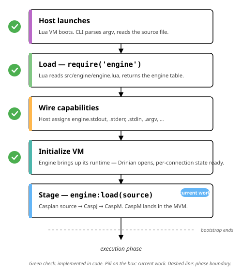

# Bootstrap

~~~vibecode
{"vibecode": {
	"doc": "requirements_bootstrap",
	"role": "canonical page for Caspian's bootstrap area — how the engine gets prepared to run, from host process startup through the loaded program sitting in the MVM ready to be walked. Vertical step-by-step diagram inside the steps section. Bootstrap ends when the engine is ready; the operational phase (running) is spec'd separately at execution/.",
	"status": "in progress — five steps spec'd at per-step pages under bootstrap/; the execution phase that follows bootstrap lives at execution/"
}}
~~~

Before any Caspian code runs, a host program has to launch, load the engine, hand it the capabilities it needs, wait for the engine to set up its runtime state, and give it the program to execute. The minimal shape from the host's side:

~~~lua
local engine = require('engine')                                       -- load
engine.stdout = { print = function(self, s) io.write(s) end }          -- wire capabilities
engine:load(source)                                                    -- stage the program (VM init runs first if not already)
-- Bootstrap ends here. engine:run() begins the execution phase — spec'd at execution/.
~~~

## The steps

### ✅ Host launches

A Lua host process starts. The VM initializes, `arg` gets populated, and the host figures out which source to load. Entirely the host's concern; the engine hasn't been loaded yet.

See [Host launches](https://www.puck.uno/requirements/bootstrap/host-launches/) for the full step.

### ✅ Load — `require('engine')`

Lua reads [src/engine/engine.lua](../../src/engine/engine.lua), executes it, and returns the engine table. That table IS the engine — no constructor, no allocation.

See [Load](https://www.puck.uno/requirements/bootstrap/load/) for the full step.

### ✅ Wire capabilities

The host fills empty slots on the engine (`engine.stdout`, `engine.stderr`, `engine.stdin`, `engine.argv`, …). Slots left unset become withheld capabilities — user code raises when it reaches for them.

See [Wire capabilities](https://www.puck.uno/requirements/bootstrap/wire/) for the full step.

### ✅ Initialize VM

The engine opens its runtime state store (the MVM — Drinian in V1). Schema applied on fresh files, seed row verified, per-connection state prepared. Distinct from Wire: the engine sets this up for itself; no host input needed.

See [Initialize VM](https://www.puck.uno/requirements/bootstrap/initialize-vm/) for the full step.

### Stage — `engine:load(source)`

The engine takes a Caspian source string, transpiles it into CaspJ, normalizes into CaspM, and writes the CaspM tree into the MVM. Program and runtime state live together, which is what makes pause / resume trivial.

See [Stage](https://www.puck.uno/requirements/bootstrap/stage/) for the full step.

## Where bootstrap ends

After Stage, the MVM holds a seeded runtime state store plus a fully-loaded CaspM tree, and the engine is a fully-formed object with its host capabilities wired. Bootstrap is done. The next thing that happens — walking the CaspM, dispatching statements, running the loaded program — is the **execution phase**, spec'd separately at [execution](https://www.puck.uno/requirements/execution/).

## Where to go for details

- [execution](https://www.puck.uno/requirements/execution/) — the operational phase that follows bootstrap.
- [drinian](https://www.puck.uno/requirements/drinian/) — the MVM's V1 implementation.
